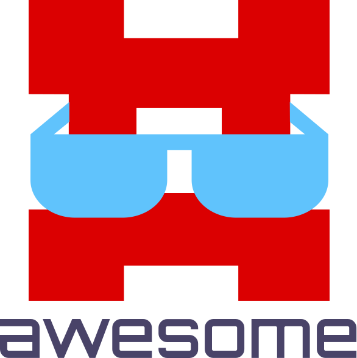

   
  
   
   

## Awesome Composi

> A curated list of awesome things related to [Composi](https://composor.github.io)

## Official Resources

- [Installation](https://www.npmjs.com/package/composi)
- [Docs](https://composor.github.io/docs/installation.html)
- [Tutorials](https://composor.github.io/tuts/index.html)
- [Source Docs](https://github.com/composor/composi/blob/master/docs/index.md)

## Contents

- [Utilites](#utilities)
- [State Management](#state-management)
- [Third Party Frameworks](#third-party-frameworks)
- [Articles](#articles)
- [Github Examples](#github-examples)
- [Codepen Examples](#codepen-examples)
- [Contributing](#contributing)

## Utilities

- [stylor](https://www.npmjs.com/package/stylor) - A module that creates virtual stylesheets for component-scoped styles.
- [pubber](https://www.npmjs.com/package/pubber) - A tiny pubsub library for communication between components

## State Management
- [Redux](http://redux.js.org) - Redux is a predictable state container for JavaScript apps.
- [Mobx](https://mobx.js.org) - MobX is a battle tested library that makes state management simple and scalable by transparently applying functional reactive programming.
- [GraphQL](http://graphql.org) - GraphQL is a query language for APIs and a runtime for fulfilling those queries with your existing data.
- [Apollo](https://www.apollographql.com/docs/react/reference/) - Apollo provides a universal GraphQL API on top of your existing services, so you can build new application features fast without waiting on backend changes.
- [State Machine](https://github.com/davestewart/javascript-state-machine) - State Machine is a library for managing a finite set of states, and moving between them via actions and transitions.

## Third Party Frameworks
- [Material Design Lite](https://getmdl.io) - Material Design Lite  includes new versions of common user interface controls such as buttons, check boxes, and text fields, adapted to follow Google's Material Design concepts.
- [Bootstrap](http://getbootstrap.com) - Build responsive, mobile-first projects on the web with the world's most popular front-end component library.

## Client Side Routing

Composi does not have its own router. That is beyond the scope of the aim of the project.
However, we do have a separate router that we like to use with Composi called [composi-router](https://www.npmjs.com/package/composi-router). Example of usage: [Tour of Heroes](https://github.com/composor/tour-of-heroes)

You could also use any of the following popular client side routing libraries:

- [Universal Router](https://www.kriasoft.com/universal-router/)
- [Page](http://visionmedia.github.io/page.js/)
- [Routie](https://www.npmjs.com/package/routie-2)
- [Routy](https://github.com/KanoComputing/routy.js)
- [Webix-routie](https://www.npmjs.com/package/webix-routie)
- [Roadtrip](https://github.com/Rich-Harris/roadtrip)
- [Jsrouter](https://github.com/jdlehman/jsrouter)

## Articles

- [Composi — A Small & Fast Component Library](https://medium.com/@trukrs/composi-a-small-fast-component-library-584c694644a3)
- [Comparing React and Composi](https://medium.com/@trukrs/comparing-react-and-composi-5afcc26953ad)
- [Reactive Components in 3KB](https://medium.com/@trukrs/reactive-components-in-3kb-37ae1cc6388a)
- [The Power of Extending Component](https://medium.com/@trukrs/the-power-of-extending-component-a75302e3bffc)
- [Composi & Redux](https://medium.com/@trukrs/composi-redux-4661f67978bb)
- [Composi & Mobx](https://medium.com/@trukrs/composi-mobx-e1bf0a21ab35)

## Codepen Examples

- [Spreadsheet](https://codepen.io/rbiggs/pen/mqyxJX) - Simple spreadsheet example.
- [Material Design Lite](https://codepen.io/rbiggs/pen/eemayx) - Buttons, card and dialog box.
- [Material Design Lite](https://codepen.io/rbiggs/pen/eemajo) - Form inputs and list.
- [Temperature Converter](https://codepen.io/rbiggs/pen/EbabdX) - Example of lift state up to parent component. This converts between Fahrenheit and Celsius.
- [Canvas Clock](https://codepen.io/rbiggs/pen/LOZmbG/) - A canvas clock created by a component.
- [SVG Clock](https://codepen.io/rbiggs/pen/RjRpxL/?editors=0010) - Swiss style clock using SVG generated by component.
- [Calculator](https://codepen.io/rbiggs/pen/EbNKKP?editors=0110) - A simple calculator.
- [Tic-Tac-Toe](https://codepen.io/rbiggs/pen/POpMMz) - An example of immutable data with time travel.
- [Coin Toss](https://codepen.io/rbiggs/pen/cada51424c4d9f3cee69aa2f1a7a10f6?editors=1010) - A Coin Toss component, just because we can.
- [Dancing Pythagoras Tree](https://codepen.io/rbiggs/pen/dd146f0881067670fe80764f6b810d7d/?editors=0011) - Animated SVG tree using D3.
- [Image Browser with Popups](https://codepen.io/rbiggs/pen/qVxvOp/?editors=0110) - An image browser that lets you popup the images like a light table.
- [Hacker News Minimal](https://codepen.io/rbiggs/pen/5677c6c41f570018e93a7898a33c3860/?editors=1010) - A minimal implementation of Hacker New that lets you sort be popularity.
- [Tour of Heroes](https://codepen.io/rbiggs/pen/xPQXWY/) - The famour Angular Tour of Heroes project converted to use Composi. This also uses Routie for client side routing, which conditional loads subcomponents.
- [Composi Slideshow](https://codepen.io/rbiggs/pen/VywZWE) - A simple, animated slideshow.
- [Rick-n-Morty](https://github.com/composor/rick-n-morty) - A site to explore Rick-n-Morty cartoon characters.

## Github Examples

- [Counters](https://github.com/composor/counters) - Dynamically add or delete multiple counters and get their total.
- [Temperature Converter](https://github.com/composor/temperature-converter) - Converts temperature between Fahrenheit and Celsius, while showing the boiling point.
- [Spreadsheet](https://github.com/composor/spreadsheet) - A simple spreadsheet solution. You can add or delete items.
- [Canvas Clock](https://github.com/composor/canvas-clock) - A simple animated clock drawn with canvas element.
- [Svg Clock](https://github.com/composor/svg-clock) - A simple animated clock rendered with SVG.
- [Calculator](https://github.com/composor/calculator) - An example of a basic calculator for addition, subtraction, multiplication and division.
- [Todo List](https://github.com/composor/todo-list) - TodoMVC without the MVC. Refactored as a component.
- [Tic-Tac-Toe](https://github.com/composor/tic-tac-toe) - This shows how to keep component state immutable for time travel.
- [Pythagoras Dancing Tree](https://github.com/composor/pythagoras-dancing-tree) - An animtated SVG tree using D3.
- [Image Browser](https://github.com/composor/image-browser) - This is a basic image browser with a popup for closer view of image.
- [Hacker News Minimal](https://github.com/composor/hacker-news-minimal) - This is a minimalistic Hacker News viewer. You can sort by popularity or rest to original order.
- [Tour of Heroes](https://github.com/composor/tour-of-heroes) - The Angular Tour of Heroes project converted to using Composi, complete with client-side routing to conitionally render components.
- [Composi Slideshow](https://github.com/composor/composi-slideshow) - A simple, animated slideshow.
- [Rick-n-Morty](https://codepen.io/rbiggs/pen/opXdKz) - A site to explore Rick-n-Morty cartoon characters.

## Contributing

To contribute, fork this repository, add your amazing entry and send us a PR. See [CONTRIBUTING](/CONTRIBUTING.md) for more information.
